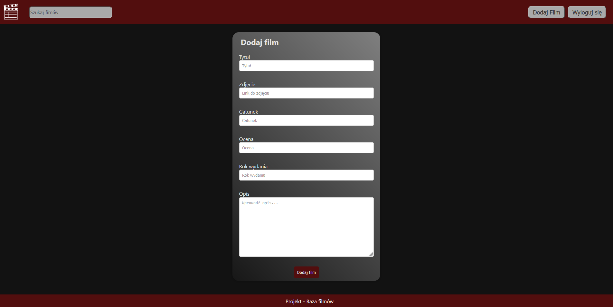

# Baza filmów

Aplikacja korzystająca z biblioteki ReactJS. 
Aplikacja posiada możliwość logowania, rejestracji, przeglądania oraz wyszukiwania filmów. 
Dodatkowo, użytkownicy mają możliwość dodawania oraz usuwania swoich filmów.

## Preview

Poniżej znajduję się krótka prezentacja dla dostępnych funkcji strony.

## Strona główna

Na stronie głównej pokazana jest lista dostępnych filmów. Dostępne są opcje wyszukiwania filmów poprzez pasek wyszukiwania,
logowania do istniejącego konta, rejestracje nowego konta, oraz dodawania własnych filmów.
Przycisk 'Zaloguj się' oraz 'Zarejestruj się' są zastąpione przez 'Dodaj film' i 'Wyloguj się' gdy użytkownik jest zalogowany.
Możliwe jest również przejście do detali wybranego filmu poprzez naciśnięcie na dowolny film.

## Detale

Po przejściu do detali dowolnie wybranego przez użytkownika filmu, można zauważyć tytuł, gatunek, rok wydania, ocenę oraz prosty opis.
Dla użytkowników zalogowanych, istnieje również opcja usuwania filmu.

## Dodawanie filmu

Aby dodać film, użytkownik musi byc zalogowany. Na stronie związanej z dodawaniem filmu, należy wypełnić pare pól, które będą zawierać informacje o filmie.

## Rejestracja

Użytkownik ma możliwość stworzenia nowego konta poprzez rejestrację. Po podaniu nazwy, adresu email oraz hasła, użytkownik może stworzyć swoje konto do którego może w dowolnym czasie się logować.

## Logowanie

Użytkownik może się zalogować do swojego konta poprzez podanie nazwy oraz hasła.

